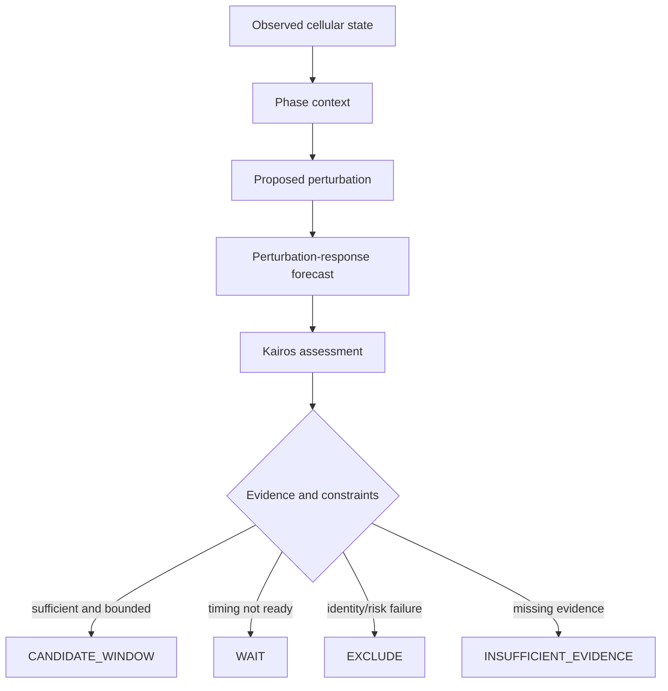

# Kairos Gate for X-Cell

> **X-Cell asks what a perturbation may cause. Kairos Gate asks when that perturbation becomes a justified transition.**

Kairos Gate is an independent, open research protocol for **phase-conditioned cellular transition prediction**. It explores whether a perturbation model can identify not only a likely response, but also the biological window in which the same intervention is most likely to reach a target state while preserving cell identity and limiting toxicity or irreversible change.

This repository is not affiliated with or endorsed by Xaira Therapeutics. It is designed as a research proposal and interoperability layer that may be evaluated alongside [X-Cell](https://github.com/Xaira-Therapeutics/X-Cell) or other perturbation-prediction systems.

## Core research question

> Can intervention timing be treated as a causal context variable in X-Cell?

Current formulation:

```text
cell state + perturbation -> predicted response
```

Kairos formulation:

```text
cell state
+ measurable dynamic phase
+ perturbation
+ intervention history
-> predicted transition trajectory
-> research-only gate assessment
```

The central claim is deliberately narrow and falsifiable:

> **The same perturbation applied in different measurable cellular phases may constitute a different causal intervention.**

## What "Kairos" means here

- **Chronos**: elapsed clock time or a fixed timepoint.
- **Kairos**: a measurable state-dependent window in which an intervention has a different expected benefit-risk profile.

Kairos is not treated as mysticism or intuition. In this project it must be represented by observable variables such as cell-cycle phase, metabolic state, calcium-signalling state, membrane potential, circadian phase, or recent perturbation history.

## Research-only decisions

Kairos Gate never authorizes a laboratory or clinical action. It classifies model outputs into research states:

- `CANDIDATE_WINDOW` — suitable for further validation;
- `WAIT` — the predicted state is not yet sufficiently favourable;
- `EXCLUDE` — risk or identity-loss constraints fail;
- `INSUFFICIENT_EVIDENCE` — the record cannot support a timing claim.

## Minimal experiment

The first benchmark is intentionally small:

1. Select one cellular context.
2. Select one or a small number of perturbations.
3. Represent at least one pre-intervention phase variable, starting with cell-cycle phase.
4. Compare a baseline perturbation predictor against a phase-conditioned predictor.
5. Measure response accuracy, target-state reachability, cell-identity preservation, and risk proxies.
6. Test whether phase conditioning improves held-out prediction.

See [Minimal Experiment](docs/MINIMAL_EXPERIMENT.md) and [Hypothesis Map](docs/HYPOTHESIS_MAP.md).

## Protocol flow



## Repository structure

```text
README.md
kairos_gate/                 deterministic reference validator
schemas/                     machine-readable transition record
examples/                    canonical research records
tests/                       regression tests
docs/
  RESEARCH_QUESTION.md
  MINIMAL_EXPERIMENT.md
  HYPOTHESIS_MAP.md
  CAUSAL_GRAPH.md
  SAFETY_AND_NON_CLAIMS.md
  PHILOSOPHICAL_ORIGIN.md
  ECOSYSTEM_BRIDGE.md
  XCELL_OUTREACH_DRAFT.md
  ROADMAP.md
```

## Quick start

```bash
python -m unittest discover -s tests -v
python -m kairos_gate examples/phase-conditioned-transition.json
```

The validator uses only the Python standard library.

## Relationship to the wider protocol family

The primary internal bridge is [Transition Intelligence Protocol](https://github.com/safal207/transition-intelligence-protocol):

```text
IFP: Is the initial state sufficiently known?
TIP: Which transition is justified next?
Kairos Gate: Is this a candidate phase window for that transition?
```

Additional roles are documented in [Ecosystem Bridge](docs/ECOSYSTEM_BRIDGE.md), including T-Trace, CML, LiminalDB, PythiaLabs, ProofPath, LRI, SOMA, and Lifetra.

## Scope boundary

Kairos Gate does **not** claim to:

- reverse aging;
- provide medical advice or treatment;
- establish that meditation, sound, music, intention, or an undefined information field directly reprograms cells;
- authorize wet-lab, animal, or human experiments;
- prove that a predicted transcriptomic state is safe.

Philosophical ideas may motivate questions, but every scientific claim in the protocol must be tied to measurable variables, controlled comparisons, provenance, and falsification criteria.

See [Safety and Non-Claims](docs/SAFETY_AND_NON_CLAIMS.md).

## Status

**v0.1 research foundation** — protocol schema, canonical example, deterministic validator, tests, safety boundaries, and outreach draft.

## License

MIT. See [LICENSE](LICENSE).
