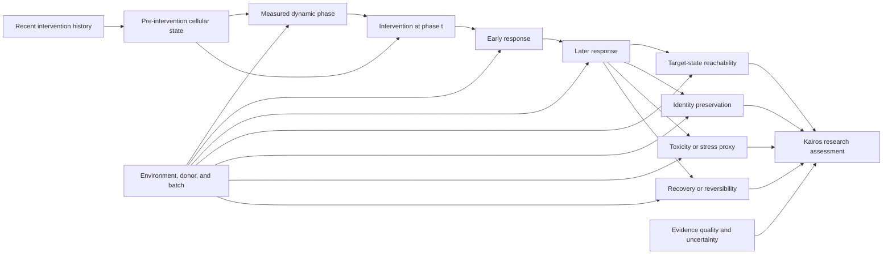

# Causal Transition Graph

## Important confounders

- dose and duration;
- cell type and donor;
- environment, batch, and replicate;
- baseline viability;
- phase-inference error;
- selection effects after perturbation;
- measurement timepoint;
- post-treatment variables accidentally used as baseline features.

## Adjustment strategy

Environment, donor, batch, and replicate may influence both measured phase and
the response outcomes directly. They must therefore be represented in the split,
matching, stratification, or adjustment plan rather than treated only as
phase-measurement noise. Post-intervention variables must not be adjusted as
baseline confounders when doing so would introduce leakage or collider bias.

## Counterfactual question

For a cell or matched population in state `S`, what response would be expected
under the same perturbation if the measurable phase were different while
relevant pre-intervention confounders remained controlled?

This counterfactual cannot be established by a diagram or predictive improvement
alone. It requires controlled or appropriately designed quasi-experimental data.
