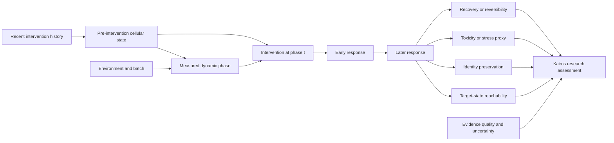

# Causal Transition Graph

## Important confounders

- dose and duration;
- cell type and donor;
- batch and replicate;
- baseline viability;
- phase-inference error;
- selection effects after perturbation;
- measurement timepoint;
- post-treatment variables accidentally used as baseline features.

## Counterfactual question

For a cell or matched population in state `S`, what response would be expected under the same perturbation if the measurable phase were different while relevant confounders remained controlled?

This counterfactual cannot be established by a diagram alone. It requires controlled or appropriately designed quasi-experimental data.
