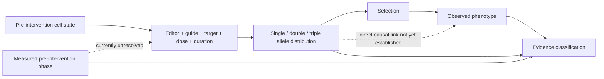

# smACGmax: 60-second evidence demo

## The public headline

> A new editor can simultaneously change adenine, cytosine, and guanine, reaching up to 41% triple-base conversion.

## What Kairos Gate does with that headline

Kairos Gate converts the headline into separate, auditable evidence states.

| Question | Current evidence state |
|---|---|
| Can A-, C-, and G-associated conversions occur in the same allele? | `AUTHOR_REPORTED` |
| Is 41% the typical rate? | `NO — REPORTED_MAXIMUM` |
| What typical value is reported across the discussed 71 HBEGF sites? | `5.5% MEAN IN AUTHOR RESPONSE — NOT YET RECALCULATED` |
| Is guanine editing context-independent? | `NO — NGR PREFERENCE REPORTED` |
| Was the editor established as the first triple-base editor? | `NO — PRIORITY CLAIM REMOVED` |
| Does toxin-selected enrichment prove one specific allele caused survival? | `NOT ESTABLISHED — ALLELE/PHENOTYPE LINKAGE PENDING` |
| Was a valid biological phase measured before editing? | `NOT ESTABLISHED` |
| Does the package authorize an experiment or clinical use? | `NO` |

## Evidence graph



## Current machine-readable disposition

```text
KAIROS_PARTIAL_NO_PREINTERVENTION_PHASE
SOURCE_BYTES_AND_DIGESTS_PENDING
METRIC_REPRODUCTION_PENDING
REPLICATE_SEMANTICS_PENDING
ALLELE_PHENOTYPE_LINKAGE_PENDING
NO_EXPERIMENT_AUTHORIZATION
```

## Ten-minute usability review

Please answer with one code and, optionally, one sentence:

- `A_CLEAR` — the distinctions are understandable;
- `B_MISSING_FIELD` — an important scientific field or state is missing;
- `C_WRONG_CLASSIFICATION` — at least one classification is scientifically wrong;
- `D_PILOT_PAPER` — you can nominate one public paper for a second case;
- `E_ROUTE` — another person or team should review this.

## What a useful response looks like

```text
B_MISSING_FIELD — add explicit delivery modality and per-cell linkage confidence.
```

or

```text
D_PILOT_PAPER — use our recent public perturbation paper at <citation>.
```

## Boundary

This is a research-only reproducibility and scientific-agent usability artifact. It is not independent replication, guide design, wet-lab instruction, medical advice, safety approval, or experiment authorization.
