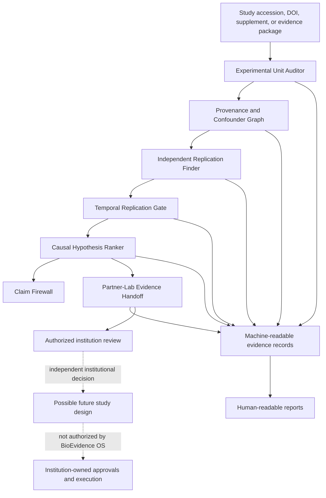
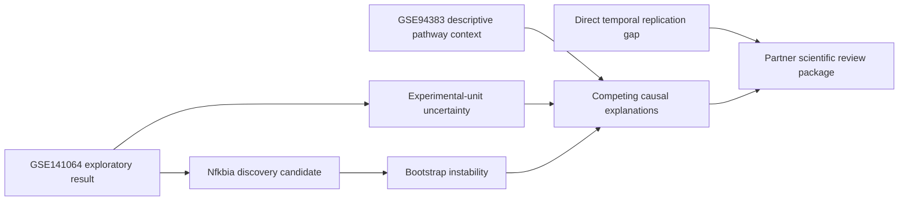
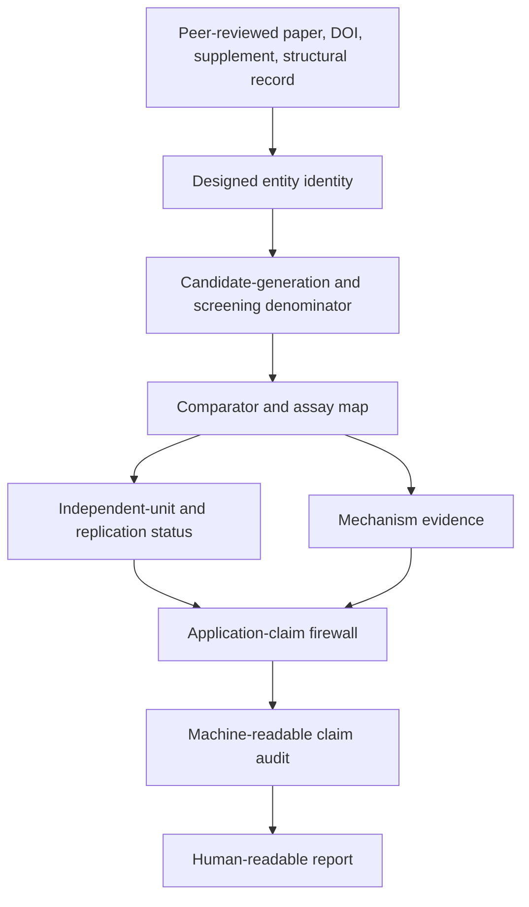

# BioEvidence OS v0.1 Architecture

## System boundary

BioEvidence OS is a computational evidence and governance layer. It consumes public or lawfully supplied scientific evidence and produces bounded conclusions, gaps, and review contracts.

It does not authorize or describe physical biological execution.

## Evidence flow



## Contract stack

| Layer | Primary question | Fail-closed boundary |
|---|---|---|
| Experimental Unit Auditor | What is independently sampled or assigned? | Cells, wells, plates, libraries, reads, and runs cannot silently become biological replicates. |
| Provenance and Confounder Graph | How did observations become claims? | Broken, unknown, or aliased load-bearing paths remain visible and limiting. |
| Independent Replication Finder | Is external evidence genuinely independent? | Same-study material, shared sources, unresolved units, reruns, and reprocessing cannot become accepted replication. |
| Temporal Replication Gate | Does timing and identity match the target claim? | Post-transition molecular measurements cannot be represented as pre-state predictors. |
| Causal Hypothesis Ranker | Which explanations compete and what would distinguish them? | Rank is not causal identification; causal escalation requires all identification gates. |
| Partner-Lab Evidence Handoff | What evidence must an institution review or return? | Scientific-review readiness never authorizes physical work. |

## Acceptance authority

Accepted contract evidence follows one executable path:

```text
record
  -> public Draft 2020-12 JSON Schema and format validation
  -> semantic fail-closed validator
  -> claim boundary
  -> ACCEPT / BLOCK
```

The semantic validator is not allowed to override schema invalidity. The exact schema digest and semantic-validator identity are preserved in the validation receipt.

## Reference-case state



Current bounded verdicts:

- exploratory GSE141064 association: supported with limits;
- GSE94383 within-table descriptive direction: observed;
- GSE94383 effective independent biological N: unresolved;
- GSE94383 replication or conceptual triangulation: on hold;
- out-of-sample prediction: not established;
- direct causal effect: blocked;
- tissue, clinical, and therapeutic claims: blocked;
- partner review package: ready for scientific discussion only;
- physical execution: not authorized.

## v0.2 preview: AI-designed molecule claim path

The SynTnpB flagship case adds a separate claim-audit path without changing the v0.1 release boundary:



Preview contract questions:

| Layer | Primary question | Fail-closed boundary |
|---|---|---|
| Designed entity identity | What did the model output, and what did the laboratory physically create? | A proposed protein sequence cannot be represented as an autonomously created and validated physical system. |
| Screening denominator | How many candidates were generated, screened, selected, and structurally characterized? | Winner performance cannot silently represent an incomplete or unknown candidate denominator. |
| Comparator map | Which exact reference was exceeded, on which target and assay? | Wild-type TnpB superiority cannot become superiority over Cas9, Cas12, or all natural editors. |
| Assay scope | What was observed in bacterial, plant-cell, human-cell, or structural systems? | Cellular molecular activity cannot become in-vivo, clinical, or field readiness. |
| Replication status | Is an unrelated laboratory replication accepted? | Peer review and multiple systems within one collaboration do not equal independent replication. |
| Mechanism evidence | What does cryo-EM or another structural assay establish? | Structural contacts cannot become complete functional causality or safety. |
| Application firewall | Which medical, agricultural, safety, or deployment claims are supported? | Clinical, therapeutic, agricultural-field, and execution claims remain blocked unless their own evidence gates are met. |

The preview contract accepts only bounded molecular and comparator claims. It contains no sequence instructions, physical procedures, delivery methods, concentrations, or execution authorization.

## Reproducibility boundary

Every accepted evidence path must preserve:

- exact source identity and immutable references;
- source checksums where available;
- exact commit and workflow run;
- validator and schema versions and digests;
- model parameters and random seeds where applicable;
- exclusions, missingness, transformations, and deviations;
- positive evidence, negative evidence, and unresolved unknowns;
- independent observation count separately from effective biological N;
- claim boundary and supersession history.

## v0.2 boundary

NVIDIA BioNeMo and other foundation-model integrations belong in a separate v0.2 branch. Model output must pass compatibility, domain-shift, species, modality, timing, training-overlap, designed-entity identity, candidate-denominator, comparator, assay-scope, replication, and evidence-level gates before entering this stack.
