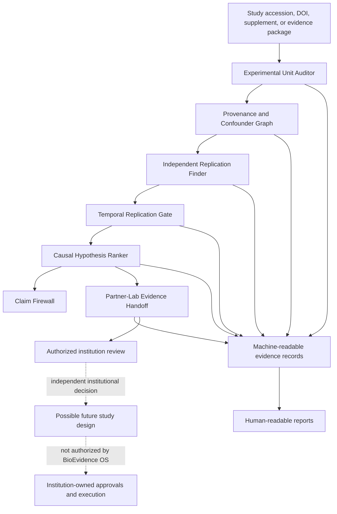
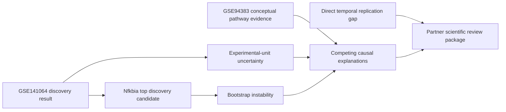

# BioEvidence OS v0.1 Architecture

## System boundary

BioEvidence OS is a computational evidence and governance layer. It consumes public or lawfully supplied scientific evidence and produces bounded conclusions, gaps, and review contracts.

It does not authorize or describe physical biological execution.

## Evidence flow

## Contract stack

| Layer | Primary question | Fail-closed boundary |
|---|---|---|
| Experimental Unit Auditor | What is independently sampled or assigned? | Cells, wells, plates, libraries, reads, and runs cannot silently become biological replicates. |
| Provenance and Confounder Graph | How did observations become claims? | Broken, unknown, or aliased load-bearing paths remain visible and limiting. |
| Independent Replication Finder | Is external evidence genuinely independent? | Same-study material, shared biological sources, reruns, and reprocessing are rejected as independent replication. |
| Temporal Replication Gate | Does timing and identity match the target claim? | Post-transition molecular measurements cannot be represented as pre-state predictors. |
| Causal Hypothesis Ranker | Which explanations compete and what would distinguish them? | Rank is not causal identification; causal escalation requires all identification gates. |
| Partner-Lab Evidence Handoff | What evidence must an institution review or return? | Scientific-review readiness never authorizes physical work. |

## Reference-case state

Current bounded verdicts:

- exploratory association: supported with limits;
- conceptual pathway coupling: supported;
- out-of-sample prediction: not established;
- direct causal effect: blocked;
- tissue, clinical, and therapeutic claims: blocked;
- partner review package: ready for scientific review;
- physical execution: not authorized.

## Reproducibility boundary

Every accepted evidence path must preserve:

- exact source identity and immutable references;
- source checksums where available;
- exact commit and workflow run;
- validator and schema versions;
- model parameters and random seeds where applicable;
- exclusions, missingness, transformations, and deviations;
- positive evidence, negative evidence, and unresolved unknowns;
- claim boundary and supersession history.

## v0.2 boundary

NVIDIA BioNeMo and other foundation-model integrations belong in a separate v0.2 branch. Model output must pass compatibility, domain-shift, species, modality, timing, training-overlap, and evidence-level gates before entering this stack.
